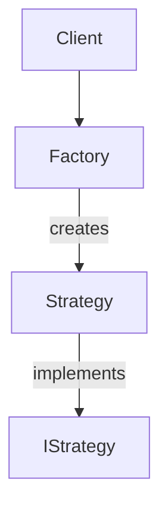

# Design Patterns in Newsagent Matching Implementation

### Strategy Pattern (Core Behavior)

#### Purpose:

The Strategy Pattern defines a family of interchangeable algorithms (matching strategies) and encapsulates each one, allowing them to be selected at runtime.

#### Implementation

1. Strategy Interface (INewsagentMatchStrategy):

       public interface INewsagentMatchStrategy
       {
           string Description { get; }           /* Human-readable explanation */
           string ChainId { get; }               /* Unique identifier for the strategy (e.g., "SUP") */
           bool IsMatch(Newsagent newsagent, ZineCoNewsagent zineCoNewsagent);       /* Core matching logic method */
       }

2. Concrete Strategies

       // SUP Matching Strategy
       public sealed class SuperNewsMatchStrategy : INewsagentMatchStrategy
       {
           public string ChainId => "SUP";
           public string Description => "Normalized field match (SuperNews)";
    
           public bool IsMatch(Newsagent n, ZineCoNewsagent z)
           {
                /* Match Logic Here */
           }
        }

        // ADV Matching Strategy
        public sealed class AdvMatchStrategy : INewsagentMatchStrategy
        {
            public string ChainId => "ADV";
            public string Description => "ADV identifier matching";
    
            public bool IsMatch(Newsagent n, ZineCoNewsagent z)
            {
                /* Match Logic Here */
            }
        }

3. Key Characteristics

   - Each strategy encapsulates a specific matching algorithm
   - All strategies follow the same interface
   - New matching rules can be added without changing existing code
   - Strategies can be tested in isolation
  
4. Usage Without Factory

       // Direct usage
       INewsagentMatchStrategy strategy = new SuperNewsMatchStrategy();
       bool isMatch = strategy.IsMatch(newsagent, zineCoNewsagent);

       // Client code depends only on the interface
       public class MatchValidator
       {
           private readonly INewsagentMatchStrategy _strategy;
    
           public MatchValidator(INewsagentMatchStrategy strategy)
           {
               _strategy = strategy;
           }
    
           public bool ValidateMatch(Newsagent n, ZineCoNewsagent z)
           {
               return _strategy.IsMatch(n, z);
           }
       }

---

### Factory Patterns (Creation Patterns)

Dictionary-Based Factory (Simple Factory Variation)

#### Purpose

Manages strategy creation and retrieval using a dictionary lookup.

#### Implementation

  - Takes strategies via dependency injection
  - Stores strategies in a case-insensitive dictionary
  - Provides GetStrategy() method that throws for unknown IDs

        public class NewsagentMatchStrategyFactory : INewsagentMatchStrategyFactory
        {
              private readonly Dictionary<string, INewsagentMatchStrategy> _strategies;

              public NewsagentMatchStrategyFactory(IEnumerable<INewsagentMatchStrategy> strategies)
                  => _strategies = strategies.ToDictionary(s => s.ChainId.ToUpperInvariant());

              public INewsagentMatchStrategy GetStrategy(string chainId)
              {
                  if (_strategies.TryGetValue(chainId.ToUpperInvariant(), out var strategy))
                      return strategy;

                  throw new ArgumentException($"Unknown chainId: {chainId}");
              }
        }

#### Registration (DI Container):

    services.AddSingleton<INewsagentMatchStrategy, SuperNewsMatchStrategy>();
    services.AddSingleton<INewsagentMatchStrategy, AdvMatchStrategy>();
    /* register more matching strategies */
    services.AddSingleton<INewsagentMatchStrategyFactory, NewsagentMatchStrategyFactory>();

#### Usage Example:
  - Direct Usage

        var factory = serviceProvider.GetService<INewsagentMatchStrategyFactory>();
        var strategy = factory.GetStrategy("SUP");
        bool isMatch = strategy.IsMatch(newsagent, zineCoNewsagent);

  - Injected Strategy in a Service
  
        // Service that depends on the strategy
        public class NewsagentMatchingService(INewsagentMatchStrategyFactory strategyFactory) : INewsagentMatchingService
        {
            public bool IsNewsagentMatch(string chainId, Newsagent newsagent, ZineCoNewsagent zineCoNewsagent)
            {
                // Get the appropriate strategy at runtime
                var strategy = strategyFactory.GetStrategy(chainId);

                return strategy.IsMatch(newsagent, zineCoNewsagent);
            }
        }

        // Registration (in Startup.cs or similar)
        services.AddSingleton<INewsagentMatchingService, NewsagentMatchingService>();

#### Adding New Strategies:

   1. Create new class implementing INewsagentMatchStrategy
   2. Register in DI container
   3. The factory automatically includes it
   
#### Key Benefits:

   1. Easy Extension: New strategies can be added without modifying existing code
   2. Decoupled Logic: Matching logic is separated from strategy selection
   3. Centralized Control: Factory handles all strategy creation
   4. DI Friendly: Works naturally with dependency injection
   5. Case Insensitive: Handles chain IDs case-insensitively
   6. Fail Fast: Throws immediately for unknown strategies

---

### Factory Method Pattern (Alternative Approach):

#### Factory Method Pattern Characteristics:

- Requires subclassing to create strategies.
- Each strategy has its own factory subclass.
- More flexible but more boilerplate.

#### How to Use the Factory Method Pattern

Step 1: Define the Strategy Interface

    public interface INewsagentMatchStrategy
    {
        string ChainId { get; }
        bool IsMatch(Newsagent newsagent, ZineCoNewsagent zineCoNewsagent);
    }

Step 2: Implement Concrete Strategies

    public class SuperNewsMatchStrategy : INewsagentMatchStrategy
    {
        public string ChainId => "SUP";
        public bool IsMatch(Newsagent n, ZineCoNewsagent z) 
            => /* SUP-specific logic */;
    }

    public class AdvMatchStrategy : INewsagentMatchStrategy
    {
        public string ChainId => "ADV";
        public bool IsMatch(Newsagent n, ZineCoNewsagent z) 
            => /* ADV-specific logic */;
    }

Step 3: Create Concrete Factories (One Per Strategy)

    // SUP Strategy Factory
    public class SupStrategyFactory : NewsagentMatchStrategyFactory
    {
        public override INewsagentMatchStrategy CreateStrategy(string chainId)
        {
            if (chainId.ToUpperInvariant() != "SUP")
                throw new ArgumentException("Invalid chainId for SUP strategy");

            return new SuperNewsMatchStrategy();
        }
    }

    // ADV Strategy Factory
    public class AdvStrategyFactory : NewsagentMatchStrategyFactory
    {
        public override INewsagentMatchStrategy CreateStrategy(string chainId)
        {
            if (chainId.ToUpperInvariant() != "ADV")
                throw new ArgumentException("Invalid chainId for ADV strategy");

            return new AdvMatchStrategy();
        }
    }

Step 4: Usage Example

  1. Direct Usage (Your Existing Example)
  
    // Initialize factories
    var supFactory = new SupStrategyFactory();
    var advFactory = new AdvStrategyFactory();

    // Get strategy dynamically (e.g., based on config/user input)
    NewsagentMatchStrategyFactory factory = GetFactoryForChain("SUP"); 
    INewsagentMatchStrategy strategy = factory.CreateStrategy("SUP");

    // Execute the strategy
    bool isMatch = strategy.IsMatch(newsagent, zineCoNewsagent);

  2. Injected Strategy in a Service
  
    // Service that depends on the strategy
    public class NewsagentMatchingService(INewsagentMatchStrategyFactory strategyFactory) : INewsagentMatchingService
    {
        public bool IsNewsagentMatch(string chainId, Newsagent newsagent, ZineCoNewsagent zineCoNewsagent)
        {
            // Get the appropriate strategy at runtime
            var strategy = strategyFactory.GetStrategy(chainId);
            return strategy.IsMatch(newsagent, zineCoNewsagent);
        }
    }

    // Registration (in Startup.cs or similar)
    services.AddSingleton<INewsagentMatchingService, NewsagentMatchingService>();

Step 5: Extending with New Strategies

  -- Add a new strategy class:

     public class NiwMatchStrategy : INewsagentMatchStrategy { ... }

  -- Add a new factory class:

     public class NiwStrategyFactory : NewsagentMatchStrategyFactory
    {
        public override INewsagentMatchStrategy CreateStrategy(string chainId)
            => chainId.ToUpperInvariant() == "NIW" 
                ? new NiwMatchStrategy() 
                : throw new ArgumentException("Invalid chainId");
    }

  -- No changes needed to existing factories or the abstract base class.

---

Pattern Comparison

| Feature | Dictionary Factory Pattern | Factory Method Pattern |
|----------|----------|----------|	
| **Extensibility**	| Add via DI registration | Requires new factory subclass |
| **Complexity** | Low (automatic discovery) | High (manual subclassing) |
| **Initialization Control** | Limited (constructor-only) | Full control in subclass
| **DI Integration** | Native support | Requires factory registration |
| **Recommended Use Case** | Most business applications | Frameworks/complex initialization |

---

